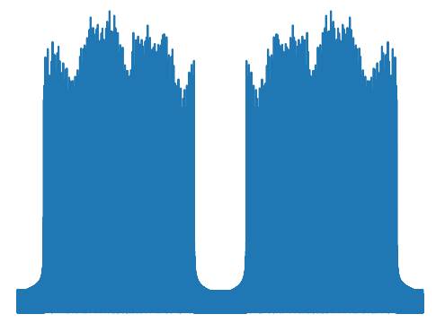

# Python OFDM transmitter and receiver



Features: Nyquist quadrature modulator, pilot tones and cyclic prefix.
[en.wikipedia.org/wiki/Orthogonal_frequency-division_multiplexing](https://en.wikipedia.org/wiki/Orthogonal_frequency-division_multiplexing)
    

## Prerequisites

Install the komm library:

```
pip3 install komm
```

## OFDM class

The package `pyofdm` contains the module `codec` which contains the class `OFDM`.

### `OFDM(nFreqSamples=64, pilotIndices=[-21, -7, 7, 21], pilotAmplitude=1, nData=12, fracCyclic=0.25, mQAM=2)`

     OFDM encoder and decoder. The data is encoded as QAM using the komm package. 
     Energy dispersal is done with a pre-seeded random number generator. Both pilot 
     tones and the cyclic prefix are added so that the start of the symbol can be 
     detected at the receiver. 
     The complex time series after the inverse Fourier Transform can be modulated 
     into a real valued stream with a Nyquist quadrature modulator for baseband. 
     On the receiver side the start of the symbol is detected by first doing a 
     coarse search with the cyclic prefix and then a precision alignment with the 
     pilots.
 
     nFreqSamples sets the number of frequency coefficients of the FFT. Pilot 
     tones are injected at pilotIndices. The real valued pilot amplitude is 
     pilotAmplitude. For transmission nData bytes are expected in an array. 
     The relative length of the Cyclic prefix is fracCyclic. 
     Number of QAM symbols = 2**mQAM, giving mQAM bits per QAM symbol. Average 
     power is normalised to unity. Default example correspond to 802.11a wifi 
     modulation.
     
### `encode(self, data, randomSeed=1)`
     Creates an OFDM symbol using QAM. 
     The signal is a complex valued numpy array where the
     encoded data-stream is appended. 
     The data is an array of bytes.
     The random seed sets the pseudo random number generator for the
     energy dispersal.

### `decode(self, randomSeed=1)`
     Decodes one symbol and returns a byte array of the
     data and the sum of the squares of the imaginary parts
     of the pilot tones. The smaller that value the better
     the symbol start detection, the reception and the jitter 
     (theoretically zero at perfect reception).
     
### `findSymbolStartIndex(self, signal, searchrangecoarse=None, searchrangefine=25)`
     Finds the start of the symbol by 1st doing a cross correlation @nIFFT
     with the cyclic prefix and then it uses the pilot tones.
     Arguments: the real valued reception signal, the coarse searchrange for
     the cyclic prefix and the fine one for the pilots.
     Returns the cross correlation value array from the cyclic prefix,
     the squared values of the imaginary parts of the pilots and the 
     index of the symbol start relative to the signal.
     
### `initDecode(self, signal, offset)`
     Starts a decoding process. The signal is the real valued received
     signal and the decoding start at the index specified by offset.

## Nyquist modulator and demodulator

These are in the module `nyquistmodem` which convert between complex
and real valued signals. The modulation is at nyquist rate which means
that its a quadrature modulator operating at a period of 4 samples for
the sine and cosine waves.
	 
### `demod(base_signal)`
     Nyqist demodulator which turns the received real valued signal into a
     complex valued sequence for the OFDM decoder.
     
### `mod(complex_signal)`
     Nyqist modulator which turns the complex valued base signal into a
     real valued sequence to be transmitted.

## Periodic OFDM indices

The module `codec` contains a function which generates evenly spaced pilots.
Call the function with the same values for `nData` and `mQAM`:
```
setpilotindex(nData, mQAM, pilotspacing)
```
and choose the pilot spacing.

## Tx/Rx-Demo

A grey value image is transmitted encoded as OFDM.

### Transmission demo

`ofdm_dvbt_tx.py` reads in the pgm image 'DC4_300x200.pgm' and saves
OFDM baseband to a WAV file 'ofdm44100.wav' You can listen to it!
Based on DVB-T 2k mode
[www.etsi.org/deliver/etsi_en/300700_300799/300744/01.06.01_60/en_300744v010601p.pdf](https://www.etsi.org/deliver/etsi_en/300700_300799/300744/01.06.01_60/en_300744v010601p.pdf)

### Reception demo

`ofdm_dvbt_rx.py` reads in OFDM baseband from the WAV file
'ofdm44100.wav'. This then detects the start of the 1st symbol 1st
with the cyclic prefix and then fine tunes it with the pilots. Then
it decodes the image.

## Wifi demo

The WIFI demo corresponds to 802.11a standard (default for pyofdm),
[rfmw.em.keysight.com//wireless/helpfiles/89600b/webhelp/subsystems/wlan-ofdm/Content/ofdm_basicprinciplesoverview.htm](https://rfmw.em.keysight.com//wireless/helpfiles/89600b/webhelp/subsystems/wlan-ofdm/Content/ofdm_basicprinciplesoverview.htm)
with 48 data carriers and 4 pilot tones. In practice the carrier
separation is 312.5kHz

`ofdm_wifi.py` generates one random symbol and shows
the absolute value of the signal, the real and imaginary parts of the
ofdm spectrum, the cross-correction value @nIFFT, the sum of the
squares of the imaginary part of the pilots, and compares output bytes
to input bytes.

## Features

- QAM modulation and demodulation is performed using Roberto Nobrega komm library [pypi.org.project/komm](https://pypi.org.project/komm) which allows the modulation order to be extended to square modulations beyond QPSK/4QAM.

- Pilots can be inserted at any user selected indices and not just regularly spaced. DC subcarrier is unmodulated by default.

- The methods `encode()` and `decode()` operate with a complex signal, suitable for quadrature modulation of a carrier. The `nyquistmodem`
module converts between a complex signal and a double-sampled real signal for basedband modulation.

- `crosscorrelation` finds the cross-correlation value at a fixed sample (nIFFT) for a sliding window of width nCyclic

- `imPilots` returns the sum of the squares of the imaginary part of the pilots
